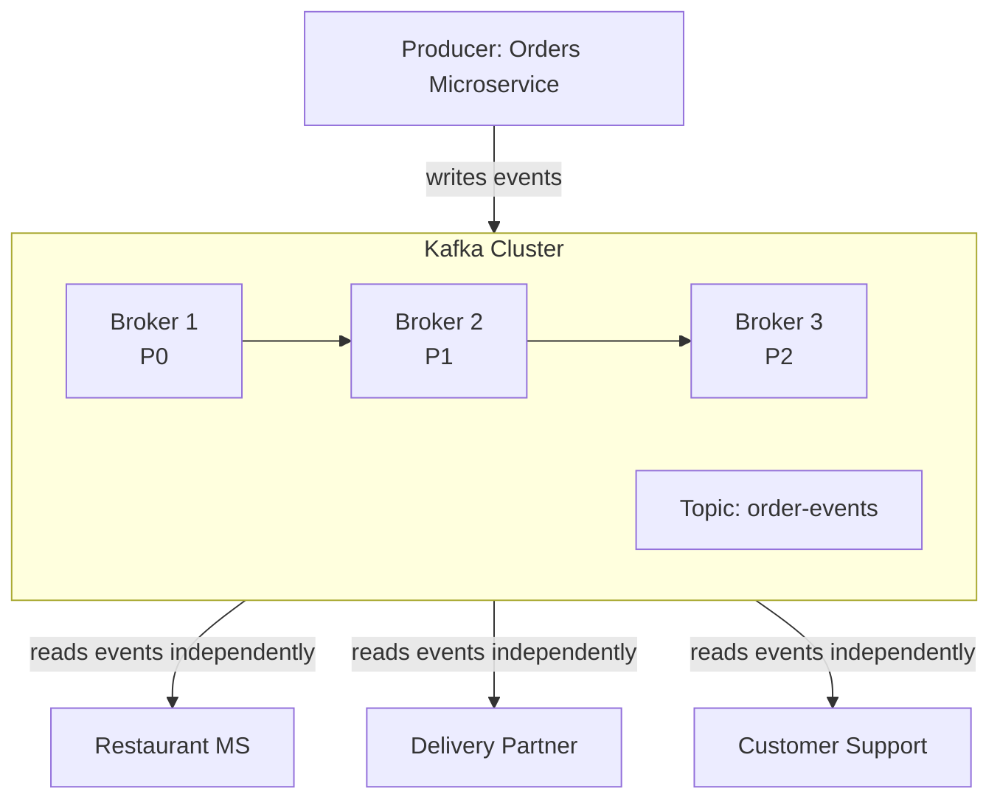

# Kafka

## Table of Contents

- [What is Kafka?](#what-is-kafka)
- [Why Kafka? The Problem with APIs](#why-kafka-the-problem-with-apis)
- [Core Kafka Concepts](#core-kafka-concepts)
- [Distributed Kafka (Kafka Cluster)](#distributed-kafka-kafka-cluster)
- [Kafka Setup](#kafka-setup)
- [Demo](#demo)

## What is Kafka?

**Apache Kafka** is a **distributed event streaming platform** - a system designed to handle continuous streams of events in real time at massive scale.

---

## Why Kafka? The Problem with APIs

### Real-World Example: Food Delivery Application

When a user places an order, a **stream of events** is created:

1. Order Created
2. Order Placed with Restaurant
3. Restaurant Accepted the Order
4. Order Ready for Preparation
5. Order Prepared
6. Order Ready to Dispatch
7. Order Out for Delivery
8. Order Delivered
9. Order Complete

This stream of events must reach **multiple microservices** simultaneously:
- Restaurant Microservice
- Delivery Partner Microservice
- Customer Support Microservice
- Internal Telemetry/Tracking Team

### Why APIs Fail for Event Streams

| Challenge | Details |
|-----------|---------|
| **Volume** | 10 events x 10 microservices = 100 API requests per order |
| **Scale** | At 1,000 orders/min → 100,000 requests/min |
| **Retries** | 5 retries per failed request → 500,000 requests/min |
| **API Compatibility** | Different services may use REST, GraphQL, or SOAP |
| **DNS/IP Changes** | In Kubernetes, IP addresses change; services must track DNS |
| **Security** | Mutual TLS (mTLS) required for every service-to-service call |

> For a stock brokering platform with 1 million users/min, you could be dealing with **5 million+ API requests per minute** - technically impossible to handle reliably.

---

## Core Kafka Concepts

### Broker
- A **Kafka broker** is a single node in the Kafka cluster.
- Analogous to a node in a Kubernetes cluster.
- Responsible for storing events and managing partitions.

### Topic
- A **virtual channel** where events are written and read.
- Producer writes to a topic; consumers read from it.
- Does not change - producers and consumers share just the topic name and Kafka address.
- There is **no direct communication** between producer and consumer.

### Producer
- The service that **writes/publishes events** to a topic.
- Example: Orders Microservice.
- Responsibility ends at writing to the topic - no retries to individual consumers.

### Consumer
- The service that **reads/consumes events** from a topic.
- Example: Restaurant Microservice, Delivery Partner Microservice, Customer Support.
- Each consumer reads **independently**.
- If a consumer is down, it can catch up later using **offsets**.

### Offset
- A marker that tracks **how far a consumer has read** in a topic.
- Allows a consumer that was offline to **go back in time** and read missed events.
- Enables both real-time and historical reads.

---

## Distributed Kafka (Kafka Cluster)

### Why Distribute?
- A single Kafka broker works for small scale.
- For massive scale (e.g., stock brokering, Netflix), you create a **Kafka cluster** with multiple brokers.
- A **3-broker Kafka cluster** is considered a **highly available** setup (same as a 3-node HA Kubernetes cluster).

### Partitions
- A topic can be split into multiple **partitions** for efficiency.
- Each partition is assigned to a broker as its **Partition Leader**.
- Producer writes different subsets of events to different partitions:
  - User 1 events → Partition 0 (P0)
  - User 2 events → Partition 1 (P1)
  - User 3 events → Partition 2 (P2)

**Advantage:** Parallel reads and writes; massively increases throughput.

### Consumer Group
- Consumers can form a **consumer group** to read in parallel.
- Each consumer in the group reads from one partition:
  - Customer Support Pod 0 → reads P0
  - Customer Support Pod 1 → reads P1
  - Customer Support Pod 2 → reads P2

### Architecture Summary



### Kafka vs APIs: Quick Comparison

| Feature | APIs | Kafka |
|--------|------|-------|
| Communication | Direct (producer → consumer) | Indirect (via topic) |
| Scale | Breaks at high volume | Handles millions of events/sec |
| Consumer failure | Producer must retry | Consumer catches up via offset |
| Latency | Seconds at scale | Near real-time (sub-second) |
| Coupling | Tight | Loose |
| Retry logic | Developer must implement | Not needed |

### Partition Leader

- When a topic is partitioned across brokers, each broker is assigned as the **leader** for one partition.
- The partition leader is responsible for:
  - **Storing** events to persistent storage (S3, EBS, EFS)
  - **Replicating** (backing up) data to other brokers for fault tolerance

### Kafka Disadvantages

- Can become **very expensive** if not managed properly.
- Common mistakes:
  - Too many topics
  - Too many partitions
  - Over-provisioned brokers

> **Tip:** Use the right number of topics, partitions, and brokers. This comes with experience.

### Managed Kafka Solutions (Recommended for Beginners)

Just like using GKE or EKS instead of self-managing Kubernetes, use a managed Kafka provider:

- **Confluent** (popular, enterprise-grade)
- **Amazon MSK** (Managed Streaming for Kafka)
- **Aiven for Kafka**

These are **cost-effective**, especially when starting out, and remove the operational overhead.

### Key Terms & Definitions

| Term | Definition |
|------|-----------|
| **Kafka** | Distributed event streaming platform |
| **Broker** | A single node in a Kafka cluster |
| **Topic** | Virtual channel for event streams |
| **Partition** | A logical subdivision of a topic for parallel processing |
| **Partition Leader** | The broker responsible for a partition's storage and replication |
| **Producer** | Writes events to a topic |
| **Consumer** | Reads events from a topic |
| **Consumer Group** | A group of consumers reading from partitions in parallel |
| **Offset** | Tracks read position; allows consumers to replay missed events |

---

## Kafka Setup

### Prerequisites

- Docker Desktop
- Python 3.11 or later

### 1. Create a virtual environment

```bash
python3 -m venv .venv
source .venv/bin/activate
pip install --upgrade pip
pip install -e .
```
### 2. Start Docker Compose

```bash
docker compose up -d
```

**OR**

### 3. Start Kafka

```bash
./scripts/start-kafka.sh
```

This starts a single-node Kafka broker on `localhost:9092` using KRaft mode.

Kafka UI is also started and available in the browser at `http://localhost:8080`.

### 4. Stop Kafka

```bash
./scripts/stop-kafka.sh
```

## Demo

This Demo Shows Real-time Event Streaming:

1. Start Kafka.
2. Start producer and show events being written.
3. Start consumer and show near real-time reads.

### Start Kafka

```bash
./scripts/start-kafka.sh
```

Optional browser view:

- Kafka UI: `http://localhost:8080`

### Create topic once

```bash
source .venv/bin/activate
python examples/live_topic_setup.py --topic order-events-live
```

### Start producer

```bash
python examples/live_producer.py --topic order-events-live --interval 1
```

You will see `PRODUCED_EVENT ...` logs continuously. So keep this session active.

### Start consumer (in a new terminal)

```bash
source .venv/bin/activate
python examples/live_consumer.py --topic order-events-live
```

You will see `CONSUMED_EVENT ...` logs almost immediately after each produced event.

Useful options:

- Read old events too: `python examples/live_consumer.py --topic order-events-live --from-beginning`
- Produce a fixed number of events: `python examples/live_producer.py --topic order-events-live --max-events 20`

### What it demonstrates

- creating a topic
- publishing JSON events continuously
- consuming those events continuously
- seeing near real-time flow from producer to consumer
